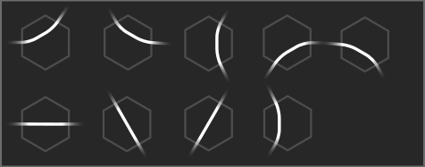

======
Tracks
======

Track Segments
==============

Tracks are built hex by hex. Each track segment is either a straight 
line or a curve. 

Track Crossings
===============

A single hex tile can have multiple track segments. When two tracks enter 
and leave different sides of the same hex, they are a crossing.

Track Junctions
================

When two track segments enter the same hex and leave through the same side, they are a junction.

Track Forks
===========

When two track segments enter the same hex and leave through different sides, they are a fork.

