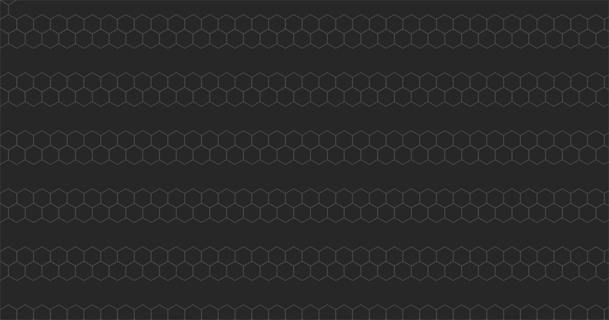
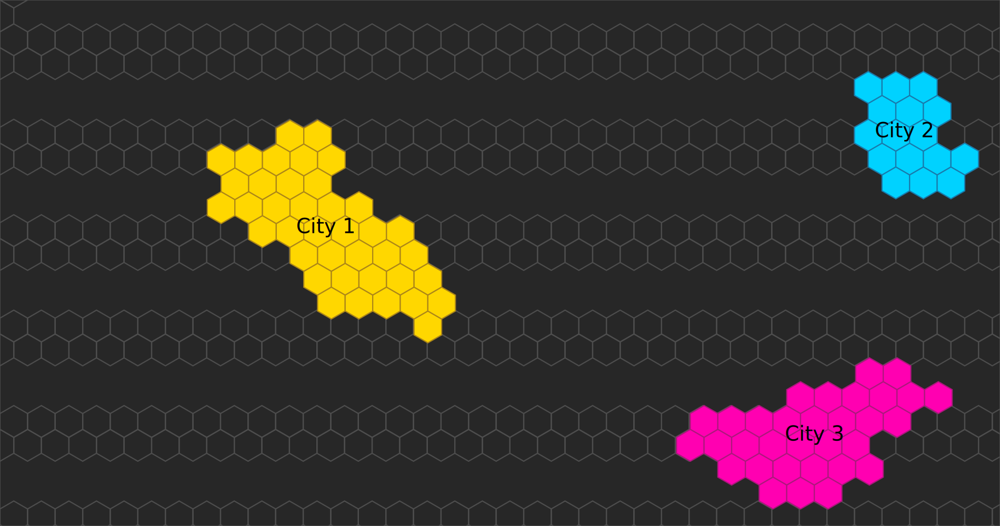
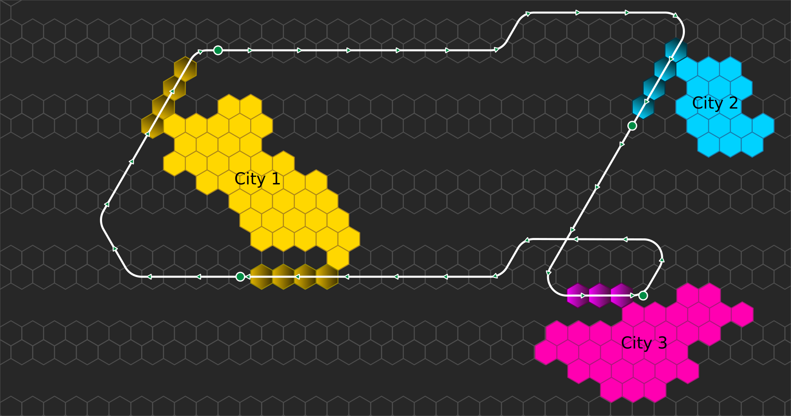

==============
User Interface
==============

The world is built on hexagonal tiles. A tile is a single unit of space. It can:

* Be empty
* Belong to a city
* Contain a train track

Cities are placed on the world map.

Railways are built, too.

   